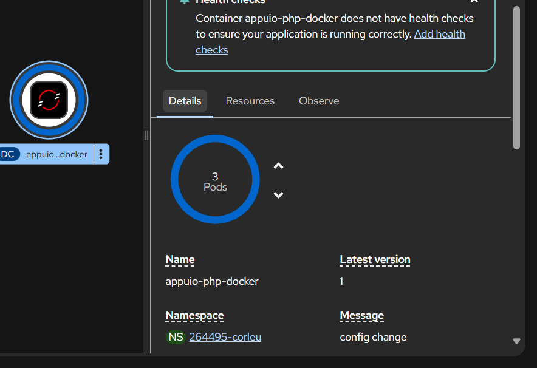
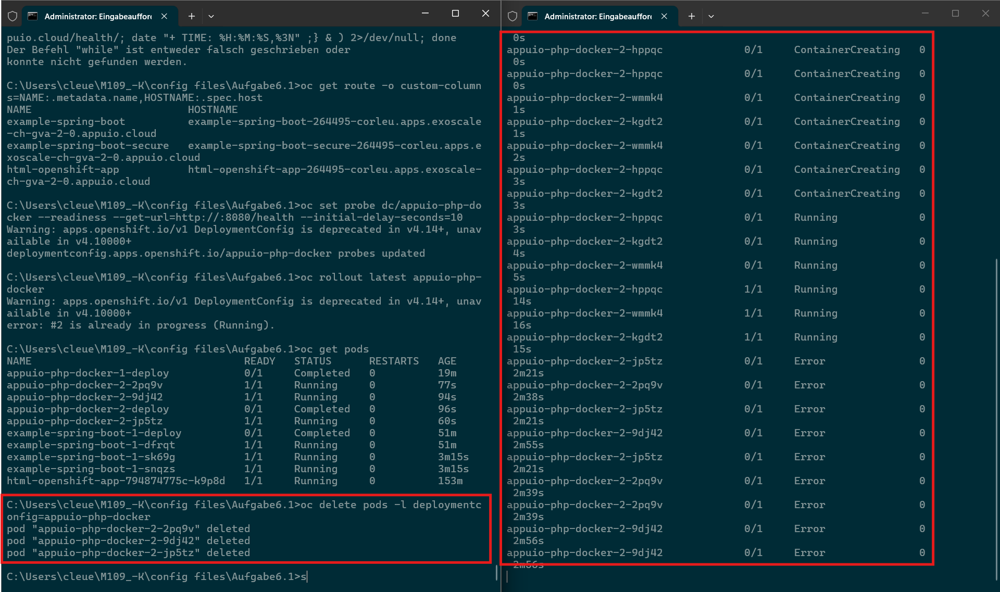

# Arbeitsaufträge
## Auftrag 3.2: Webserver mit Docker
* Erstellen Sie eine einfache HTML-Webseite (z. B. index.html). Die Erstellung kann selbstständig oder mit Unterstützung einer KI erfolgen.
<br>
[index.html](Rescources/index.html)

* Nutzen Sie ein geeignetes Container-Image von Docker Hub, z. B. das Image nginx: https://hub.docker.com/_/nginx.

* Starten Sie einen Container auf Ihrer lokalen Container Engine (z. B. Docker), der Ihre HTML-Webseite ausliefert.


## Auftrag 3.3: Python-Webserver und Dateiverwaltung in Containern
1. Python-Webserver erstellen:<br>


## Aufgabe 4.5: Migration von Docker Compose zu Kubernetes
```
version: '3.8'

services:
  wordpress:
    image: wordpress:6.4-apache
    ports:
      - "8080:80"
    restart: always
    environment:
      WORDPRESS_DB_HOST: db:3306
      WORDPRESS_DB_USER: wordpress
      WORDPRESS_DB_PASSWORD: wordpress
      WORDPRESS_DB_NAME: wordpress
    depends_on:
      - db

  db:
    image: mariadb:10.6
    restart: always
    environment:
      MYSQL_DATABASE: wordpress
      MYSQL_USER: wordpress
      MYSQL_PASSWORD: wordpress
      MYSQL_ROOT_PASSWORD: rootpassword
    volumes:
      - db_data:/var/lib/mysql

volumes:
  db_data:
```
### Aufgabe 1
* **Welche Services existieren?**
- Wordpress
- Mariadb
* **Welcher Service ist zustandslos (stateless)?**
- Wordpress
* **Welcher Service ist zustandsbehaftet (stateful)?**
- Mariadb
* **Wie kommunizieren die Services miteinander?**
- ```WORDPRESS_DB_HOST: db:3306```
* **Welche Daten müssen persistent gespeichert werden?**
-  db_data:/var/lib/mysql

### Aufgabe 2: Mapping zu Kubernetes

| Docker Compose | Kubernetes |
|---|---|
| `service` | Deployment + Service |
| `ports` | Service (ClusterIP / NodePort / LoadBalancer) |
| `environment` | ConfigMap / Secret |
| `volumes` | PersistentVolumeClaim |
- Kubernetes startet alle Pods gleichzeitig und erwartet, dass jede App selbst wartet bis ihre Abhängigkeiten bereit sind.


# Auftrag 6.3: Appuio Tech Labs
## Lab 4: Ein Container Image deployen
1. Container Image deployen<br>
```
oc new-app quay.io/appuio/example-spring-boot --as-deployment-config
```
```
C:\Users\cleue\M109_-K\config files\Aufgabe6.1>oc get pods -w
NAME                                  READY   STATUS      RESTARTS   AGE
example-spring-boot-1-deploy          0/1     Completed   0          92s
example-spring-boot-1-dfrqt           1/1     Running     0          91s
html-openshift-app-794874775c-k9p8d   1/1     Running     0          103m
```


## Lab 5: Routen erstellen
1. routen prüfen
```
oc get routes
```
2. service namen holen
```
oc get services
```
3. ungesichert
```
oc expose service example-spring-boot
```
4. gesichert
```
oc create route edge example-spring-boot-secure --service=example-spring-boot
```

## Lab 6: Pod Scaling, Readiness Probe und Self Healing
1. neue Applikation
```
oc new-app appuio/example-php-docker-helloworld --name=appuio-php-docker --as-deployment-config
```
2. ReplicationController kontrollieren
```
oc get rc
```
3. Skalieren unserer Beispiel Applikation
```
C:\Users\cleue\M109_-K\config files\Aufgabe6.1>oc scale --replicas=3 dc/appuio-php-docker
Warning: apps.openshift.io/v1 DeploymentConfig is deprecated in v4.14+, unavailable in v4.10000+
Warning: extensions/v1beta1 Scale is deprecated in v1.2+, unavailable in v1.16+
deploymentconfig.apps.openshift.io/appuio-php-docker scaled
```
den Service kontrollieren
```
C:\Users\cleue\M109_-K\config files\Aufgabe6.1>oc describe svc appuio-php-docker
Name:                     appuio-php-docker
Namespace:                264495-corleu
Labels:                   app=appuio-php-docker
                          app.kubernetes.io/component=appuio-php-docker
                          app.kubernetes.io/instance=appuio-php-docker
Annotations:              openshift.io/generated-by: OpenShiftNewApp
Selector:                 deploymentconfig=appuio-php-docker
Type:                     ClusterIP
IP Family Policy:         SingleStack
IP Families:              IPv4
IP:                       172.30.166.13
IPs:                      172.30.166.13
Port:                     8080-tcp  8080/TCP
TargetPort:               8080/TCP
Endpoints:                10.0.10.182:8080,10.0.6.34:8080,10.0.11.154:8080
Port:                     8443-tcp  8443/TCP
TargetPort:               8443/TCP
Endpoints:                10.0.10.182:8443,10.0.6.34:8443,10.0.11.154:8443
Session Affinity:         None
Internal Traffic Policy:  Cluster
Events:                   <none>
```
4. Skalierte App in der Web Console

5. Readiness Probe
```
oc set probe dc/appuio-php-docker --readiness --get-url=http://:8080/health --initial-delay-seconds=10
```
6. löschen beobachten



