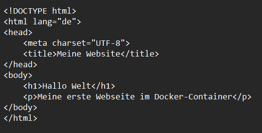
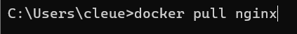
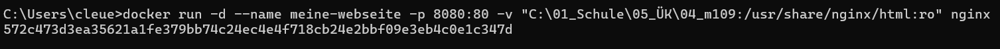

# Arbeitsaufträge
## Auftrag 3.2: Webserver mit Docker
* Erstellen Sie eine einfache HTML-Webseite (z. B. index.html). Die Erstellung kann selbstständig oder mit Unterstützung einer KI erfolgen.
 
[index.html](Rescources/index.html)

* Nutzen Sie ein geeignetes Container-Image von Docker Hub, z. B. das Image nginx: https://hub.docker.com/_/nginx.

* Starten Sie einen Container auf Ihrer lokalen Container Engine (z. B. Docker), der Ihre HTML-Webseite ausliefert.

## Auftrag 3.3: Python-Webserver und Dateiverwaltung in Containern
1. Python-Webserver erstellen: 
